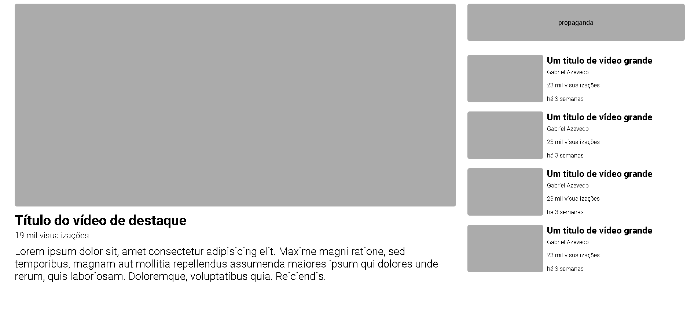
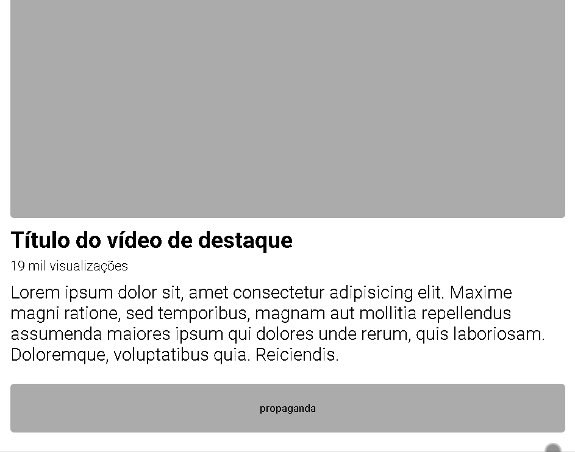
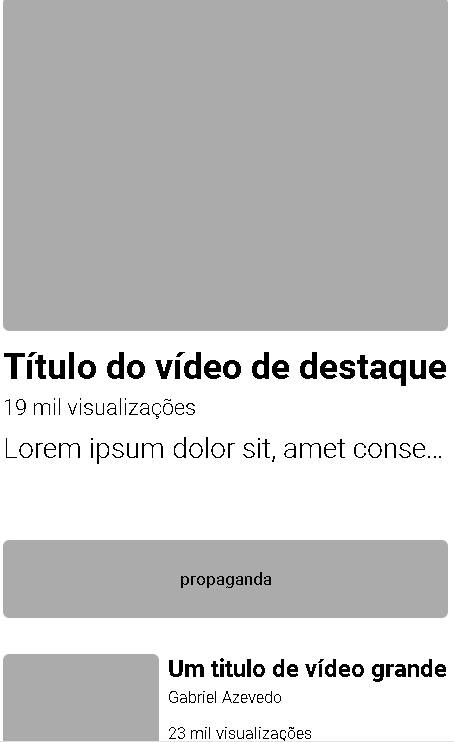

# Youtube Layout Clone
projetinho do curso Dev Quest com intuito de treinar flexbox e layouts modernos  
<a href="https://baagriel.github.io/Youtube-Clone/" target="blank">Testar</a>

## Screenshots
### Versão para computadores

### Versão para tablets

### Versão para celulares

## Stack utilizada

**Front-end:** HTML, Sass, CSS
